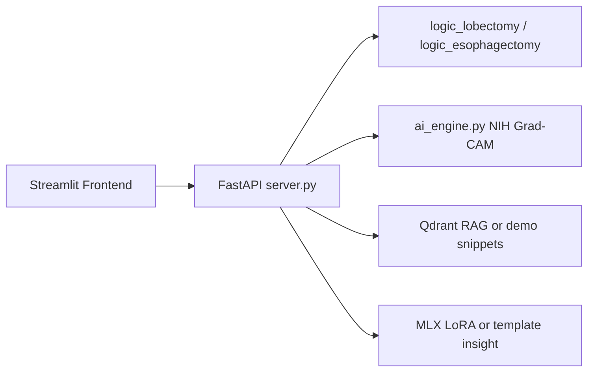

# Thoracic Post-Operative CDSS

Clinical decision support for thoracic surgery recovery: rule-based chest tube / diet recommendations, chest X-ray AI (NIH Grad-CAM), optional RAG over guidelines, and optional local SLM briefing.

This repository is prepared for **portfolio use**. Training datasets, fine-tuned weights, and copyrighted guideline PDFs are **not** included. Use **Demo Mode** to run the full UI without those assets.

## Architecture



## Demo vs full local mode

| Component | Demo Mode (`DEMO_MODE=1`) | Full local mode |
|-----------|---------------------------|-----------------|
| Rule engines | Real | Real |
| NIH CXR + Grad-CAM | Real (public pretrained) | Real |
| VinDr object detection | Disabled | Requires local `.pth` |
| RAG | Paraphrased demo snippets | Qdrant + your PDFs |
| Agent insight | Template briefing | MLX + LoRA adapters |

## Quick start (portfolio demo)

```bash
python3 -m venv .venv
source .venv/bin/activate
pip install -r requirements.txt

# Terminal 1
chmod +x run_demo.sh run_frontend.sh
./run_demo.sh

# Terminal 2
./run_frontend.sh
```

Open the Streamlit URL (usually http://localhost:8501). Click **데모 샘플 CXR 불러오기** or upload any chest X-ray, then **Run Full Analysis**.

Health check: http://127.0.0.1:8000/api/v1/health

## Full local mode (your machine only)

1. Set `DEMO_MODE=0` in `.env` (see `.env.example`).
2. Place VinDr weights at `backend_api/weights/vindr_det_epoch_10.pth`.
3. Place MLX LoRA adapters in `backend_api/adapters/`.
4. Build Qdrant DB: `cd research_and_training && python rebuild_db.py` (requires PDFs in `data/`).
5. Install optional dependencies commented in `requirements.txt`.
6. Run `./run_backend.sh` instead of `./run_demo.sh`.

## Project layout

| Path | Role |
|------|------|
| `frontend/` | Streamlit UI + demo sample CXR |
| `backend_api/` | FastAPI server, rule engines, CXR AI |
| `research_and_training/` | Training / RAG build scripts (reference) |
| `run_demo.sh` | Backend with `DEMO_MODE=1` |
| `run_backend.sh` | Backend for full local mode |

## Training pipeline

See [research_and_training/DATA.md](research_and_training/DATA.md) for expected folder layouts and dataset links. No raw data ships with this repo.

## Data and license notice

- **VinDr-CXR**: PhysioNet — access agreement required; annotations and images are not redistributed here.
- **NIH ChestX-ray14**: public research dataset; obtain separately for training scripts.
- **CheXmask**: obtain under its license for segmentation experiments.
- **Guideline PDFs**: copyrighted; not included. Demo mode uses original paraphrased snippets only.

## Publishing to GitHub

Do **not** make an existing private repo public if adapter weights were ever committed. Use a **fresh repository** without sensitive history:

```bash
./scripts/prepare_public_push.sh
```

Follow the printed steps to create a new public repo and push.

## Disclaimer

For research and portfolio demonstration only. Not for clinical use without proper validation and regulatory review.
