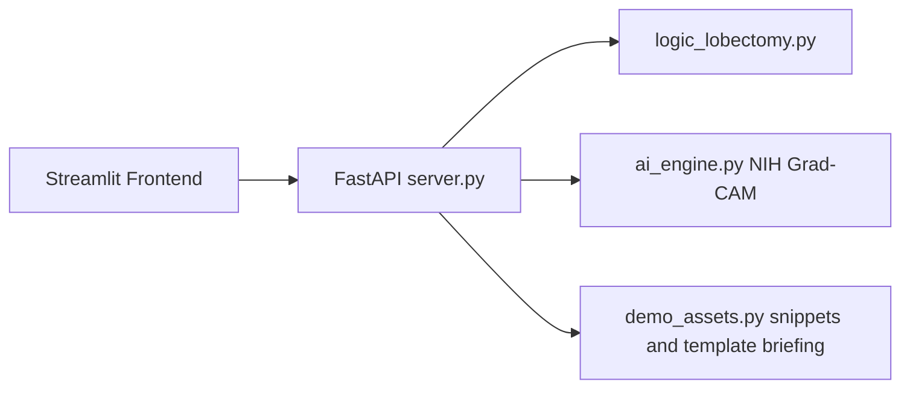

# ThorAI [Thoracic Post-Operative CDSS](Portfolio Demo)

Clinical decision support for lobectomy recovery: rule-based chest tube recommendations, NIH Chest X-ray Grad-CAM analysis, paraphrased guideline snippets, and a template clinical briefing.

This repository ships **demo mode only**. Training scripts, fine-tuned weights, vector databases, and copyrighted guideline PDFs are **not** included.

## Architecture



| Component | Demo behavior |
|-----------|---------------|
| Rule engine | Live lobectomy chest-tube logic |
| NIH CXR + Grad-CAM | Live (public pretrained weights via torchxrayvision) |
| Guideline evidence | Paraphrased demo snippets (no PDFs or vector DB) |
| Agent insight | Template briefing (no local SLM) |

## Quick start

```bash
python3 -m venv .venv
source .venv/bin/activate
pip install -r requirements.txt

# Terminal 1
./run_demo.sh

# Terminal 2
./run_frontend.sh
```

Open the Streamlit URL (usually http://localhost:8501). Click **Load Demo Sample CXR** or upload any chest X-ray, then **Run Full Analysis**.

Health check: http://127.0.0.1:8000/api/v1/health

## Project layout

| Path | Role |
|------|------|
| `frontend/` | Streamlit UI and synthetic demo CXR |
| `backend_api/` | FastAPI server, rule engine, CXR AI, demo fallbacks |
| `run_demo.sh` | Starts the backend with demo mode enabled |
| `run_frontend.sh` | Starts the Streamlit UI |

## Disclaimer

This repository is provided for **research and portfolio demonstration only**. It is **not** intended for clinical diagnosis, treatment, or decision-making without independent validation and appropriate regulatory review.

The bundled demo chest X-ray (`frontend/demo_assets/sample_cxr.png`) is a **synthetic image** for UI demonstration. Do not replace it with identifiable clinical images or licensed dataset samples in public repositories.

## References

- Wang, X., et al. (2017). ChestX-ray8. CVPR.
- TorchXRayVision: public pretrained chest X-ray models used for Grad-CAM in demo mode.
- Gaggion, N., Mosquera, C., Mansilla, L. et al. CheXmask: a large-scale dataset of anatomical segmentation masks for multi-center chest x-ray images. Sci Data 11, 511 (2024). https://doi.org/10.1038/s41597-024-03358-1
- Duc Nguyen, DungNB, Ha Q. Nguyen, Julia Elliott, NguyenThanhNhan, and Phil Culliton. VinBigData Chest X-ray Abnormalities Detection. https://kaggle.com/competitions/vinbigdata-chest-xray-abnormalities-detection, 2020. Kaggle.
